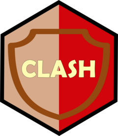

<!-- README.md is generated from README.Rmd. Please edit that file -->

```{r, include = FALSE}
knitr::opts_chunk$set(
  collapse = TRUE,
  comment = "#>",
  fig.path = "man/figures/README-",
  out.width = "100%"
)
```

# clash <a href="http://christophertkenny.com/clash/"></a>

<!-- badges: start -->
[](https://github.com/christopherkenny/clash/actions/workflows/R-CMD-check.yaml)
[](https://christopherkenny.r-universe.dev/clash)
[](https://lifecycle.r-lib.org/articles/stages.html#stable)
<!-- badges: end -->

`clash` provides an R interface to the [Clash of Clans
API](https://developer.clashofclans.com/#/).

## Installation

You can install the development version of `clash` from
[GitHub](https://github.com/) with:

``` r
# install.packages("remotes")
remotes::install_github("christopherkenny/clash")
```

## Example

Current endpoints are included for cards, rankings, tournaments, players, and clans.

To get a player’s data, we can use:

```{r example}
library(clash)

coc_get_player('92GCQQYP')
```

To get a clan, we can use:

```{r}
clan <- coc_get_clan('8UC2J9OY')
clan
```
This returns clan-level attributes, such as lists of members in the clan:

```{r}
clan$member_list
```


## Disclaimer

**This content is not affiliated with, endorsed, sponsored, or
specifically approved by Supercell and Supercell is not responsible for
it. For more information see Supercell’s Fan Content Policy:
\<www.supercell.com/fan-content-policy\>.**
